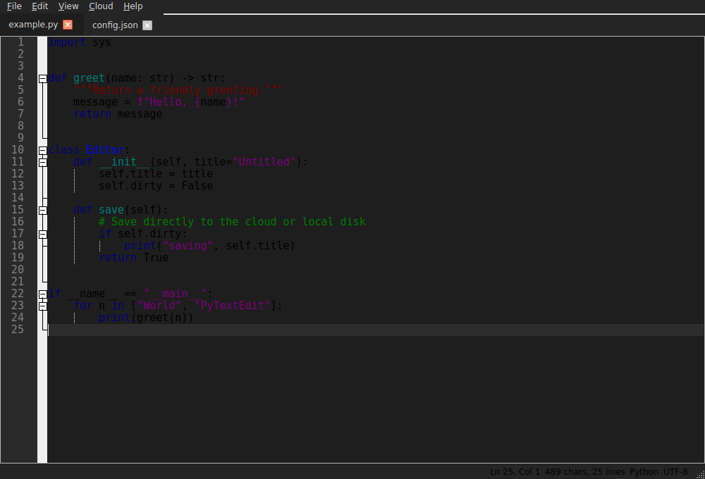

# PyTextEdit

A Notepad++-style desktop text editor written in Python, with the ability to
**save files directly to the cloud** (Google Drive and OneDrive).

It is built on **PyQt6** and **QScintilla** — QScintilla is the Python binding
of *Scintilla*, the very editing component that Notepad++ itself is built on —
so you get authentic line numbers, syntax highlighting, code folding, brace
matching, and multi-tab editing.



## Features

- **Tabbed editing** — open many documents at once; drag to reorder.
- **Syntax highlighting** for 30+ languages, auto-selected by file extension
  (Python, JS/TS, JSON, HTML/XML, CSS, C/C++, Java, C#, Bash, SQL, Markdown,
  YAML, Ruby, Perl, Lua, and more).
- **Line numbers, code folding, brace matching, auto-indent** and indentation
  guides.
- **Find & Replace** with match-case, whole-word, regex, and wrap-around.
- **Light and dark themes.**
- **Word-wrap and whitespace-visibility** toggles; **zoom** in/out/reset.
- **Local open/save** plus **recent files**.
- **Cloud save & open** for **Google Drive** and **OneDrive**, with a folder
  browser. Cloud I/O runs off the UI thread so the editor never freezes.
- Unsaved-changes protection when closing tabs or the window.

## Installation

Requires Python 3.9+.

```bash
# Core editor
pip install -e .

# ...or with cloud support:
pip install -e ".[cloud]"     # both providers
pip install -e ".[gdrive]"    # Google Drive only
pip install -e ".[onedrive]"  # OneDrive only
```

Or install straight from `requirements.txt`:

```bash
pip install -r requirements.txt
```

> On Linux you may also need the Qt runtime libraries, e.g.
> `sudo apt install libegl1 libgl1 libxkbcommon0`.

## Running

```bash
pytextedit                 # after `pip install`
# or, without installing:
python -m pytextedit
# open files directly:
pytextedit notes.txt main.py
```

## Cloud setup

Cloud providers are **optional** and require your own OAuth credentials (this
keeps *your* files under *your* app, and no secrets are bundled in the code).
The editor's **Cloud → "Where are my credentials stored?"** menu shows the
exact paths on your machine. They live under a per-user config directory:

- Linux:   `~/.config/PyTextEdit/`
- macOS:   `~/Library/Application Support/PyTextEdit/`
- Windows: `%APPDATA%\PyTextEdit\`

Cached OAuth tokens are written to a `tokens/` subfolder with `0600`
permissions and never touch the project directory.

### Google Drive

1. In the [Google Cloud Console](https://console.cloud.google.com/), create a
   project and **enable the Google Drive API**.
2. Under *APIs & Services → Credentials*, create an **OAuth client ID** of type
   **Desktop app** and download the JSON.
3. Save it as `google_client_secret.json` in the config directory above.
4. In PyTextEdit choose **Cloud → Google Drive → Open/Save**. A browser opens
   for consent the first time; the token is then cached and auto-refreshed.

### OneDrive

1. In the [Azure portal](https://portal.azure.com/) → *App registrations*,
   register an app. Under *Authentication* add a **Mobile and desktop
   applications** platform with redirect URI `http://localhost`, and enable
   *"Allow public client flows"*.
2. Under *API permissions* add the delegated Microsoft Graph permission
   **`Files.ReadWrite`**.
3. Create `onedrive_config.json` in the config directory containing:

   ```json
   {
     "client_id": "YOUR-APPLICATION-CLIENT-ID",
     "authority": "https://login.microsoftonline.com/common"
   }
   ```

4. In PyTextEdit choose **Cloud → OneDrive → Open/Save**. Authentication uses
   the **device-code flow**: a URL and code are shown to complete sign-in in
   your browser (works even on headless machines).

## Project layout

```
pytextedit/
├── __main__.py          # entry point (python -m pytextedit)
├── app.py               # main window: tabs, menus, file & cloud actions
├── config.py            # settings + credential/token paths
├── editor/
│   ├── editor_widget.py # QScintilla editor + theming
│   └── lexers.py        # extension → syntax-highlighting lexer
├── cloud/
│   ├── base.py          # CloudProvider interface
│   ├── gdrive.py        # Google Drive provider
│   ├── onedrive.py      # OneDrive provider
│   └── manager.py       # provider registry
└── ui/
    ├── cloud_dialog.py  # cloud folder browser
    ├── find_replace.py  # find/replace dialog
    └── worker.py        # background thread for cloud I/O
```

## Extending with another cloud provider

Implement `pytextedit.cloud.base.CloudProvider` (six methods:
`is_available`, `is_authenticated`, `authenticate`, `list_files`, `download`,
`upload`) and register an instance in `pytextedit/cloud/manager.py`. The UI
menus and browser dialog pick it up automatically.

## License

MIT
