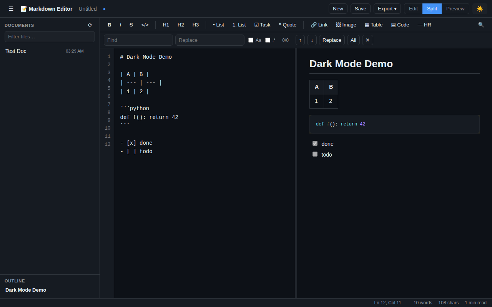

# 📝 Markdown Editor

A **full-featured, browser-based Markdown editor** with a Python backend. It
renders Markdown to HTML server-side with `python-markdown` + Pygments, and
serves a fast, dependency-free single-page UI with a live split preview,
document workspace, toolbar, keyboard shortcuts, find & replace, and export.



## Features

**Editing**
- Live, debounced preview rendered by Python (GitHub-flavoured Markdown)
- Formatting toolbar (bold, italic, strikethrough, code, headings, lists,
  task lists, quotes, links, images, tables, code blocks, horizontal rules)
- Keyboard shortcuts: `Ctrl+B`/`I`/`K`/`` ` ``, `Ctrl+S`, `Ctrl+F`, `Ctrl+G`,
  `Ctrl+Alt+N` (new), `Ctrl+Alt+T` (theme), `Ctrl+\` (sidebar)
- Smart editor: line numbers, auto-continued lists/quotes, Tab/Shift-Tab
  indentation, live cursor position & selection length
- Find & replace with case-sensitivity, regex, and match navigation

**Markdown support**
- Tables, footnotes, definition lists, abbreviations, attribute lists
- Fenced code blocks with **Pygments** syntax highlighting
- Task lists, strikethrough, subscript/superscript, insert/mark
- Admonition ("callout") blocks, smart typography, auto-linking
- Auto-generated header anchors, table of contents, and outline navigation

**Documents & workspace**
- Create, open, rename, delete documents stored as `.md` files
- Autosave, unsaved-changes indicator, and file filter
- Path-safe storage (traversal and unsafe names are rejected)

**Preview & export**
- Split / editor-only / preview-only view modes with a draggable splitter
- Scroll sync between editor and preview
- Light & dark themes (persisted)
- Export to standalone **HTML**, raw **Markdown**, or **PDF** (via print)
- Word / character count and reading-time estimate

## Install

Requires Python 3.9+.

```bash
pip install -r requirements.txt
# or, as a package (adds the `markdown-editor` command):
pip install -e .
```

## Run

```bash
python -m markdown_editor          # or: python run.py
```

Then open <http://127.0.0.1:8000/> (a browser opens automatically).

### Options

```
python -m markdown_editor --help

  --host HOST         interface to bind (default: 127.0.0.1)
  --port PORT         port to listen on (default: 8000)
  --workspace DIR     where documents are stored
                      (default: $MDEDITOR_WORKSPACE or ~/markdown-editor-docs)
  --no-browser        do not open a browser on start
  --debug             run Flask in debug mode
```

Documents are stored as plain `.md` files in the workspace directory, so they
remain readable and portable outside the app.

## Architecture

```
markdown_editor/
├── app.py            Flask application factory + JSON API
├── renderer.py       Markdown → HTML (preview & standalone export)
├── storage.py        Path-safe .md document workspace (CRUD)
├── __main__.py       CLI runner (python -m markdown_editor)
├── templates/        index.html (single-page UI)
└── static/           style.css (themes + Pygments), app.js (controller)
tests/                pytest suite (renderer, storage, HTTP API)
```

The frontend is intentionally build-step-free vanilla JavaScript. All Markdown
rendering happens in Python, so the preview and the exported HTML are always
identical.

### HTTP API

| Method & path | Purpose |
| --- | --- |
| `POST /api/render` | Markdown → preview HTML + stats + TOC |
| `GET /api/documents` | list documents |
| `POST /api/documents` | create a document |
| `GET /api/documents/<name>` | read a document |
| `PUT /api/documents/<name>` | save (overwrite) a document |
| `POST /api/documents/<name>/rename` | rename a document |
| `DELETE /api/documents/<name>` | delete a document |
| `POST /api/export/html` | download standalone HTML |
| `POST /api/export/markdown` | download raw Markdown |

## Development

```bash
pip install -e ".[dev]"
pytest
```

## License

MIT
